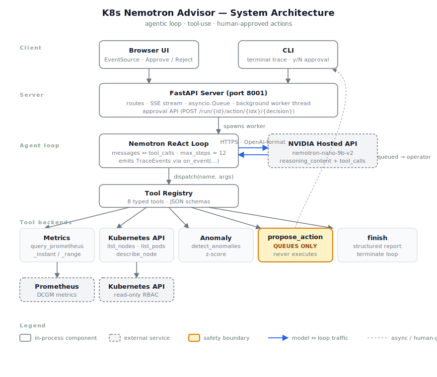
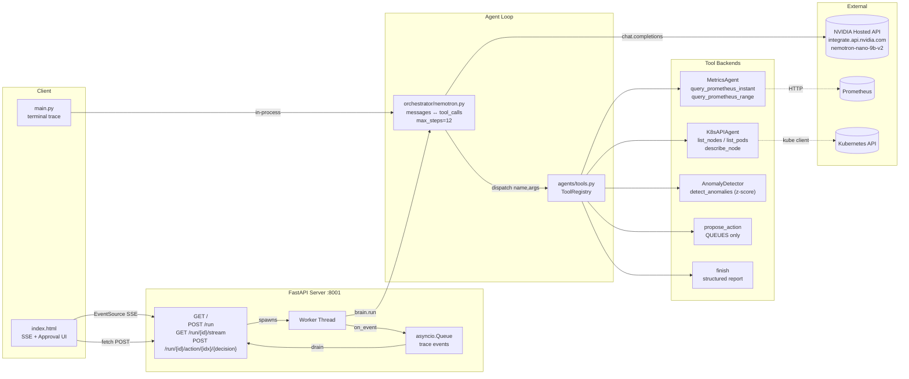
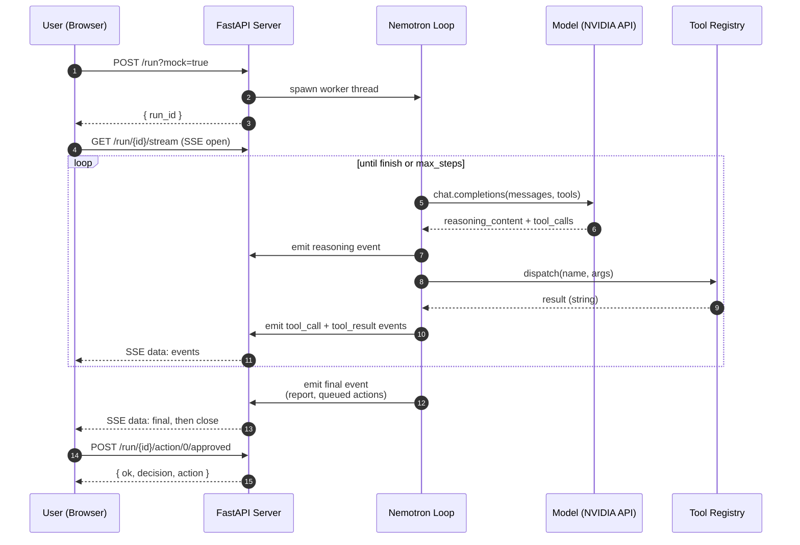

# K8s Nemotron Advisor

An agentic Kubernetes cluster advisor for GPU training fleets, powered by
NVIDIA's [Nemotron Nano 9B v2](https://build.nvidia.com/nvidia/nvidia-nemotron-nano-9b-v2)
reasoning model. The model investigates the cluster via a tool-use loop — it
chooses which Prometheus queries to run, which nodes to describe, and which
remediation to propose. A human operator approves or rejects each proposal
before anything would be applied.

The model never has direct write access to the cluster. Every mutation goes
through a typed approval queue.

---

## Demo (no cluster required)

```bash
# 1. install
python3 -m venv .venv && .venv/bin/pip install -r requirements.txt

# 2. set your NVIDIA API key
cp .env.example .env   # then edit and paste your key
# or: export NVIDIA_API_KEY=nvapi-...

# 3a. CLI — streams a colorized trace to the terminal
.venv/bin/python main.py --mock --auto-approve

# 3b. UI — open http://127.0.0.1:8001 in a browser
.venv/bin/python -m ui.server
```

`--mock` swaps the real Prometheus / Kubernetes backends for an in-process
fake cluster with one intentionally degraded node (`gpu-3`: thermal
throttling, elevated power draw, pod restarts). The agent should locate it
and propose a cordon.

A typical run takes 5–7 model turns over ~30 seconds.

---

## Architecture



Three layers, separated so each can change independently:

| Layer | What it is | Where |
|-------|------------|-------|
| **Model + Loop** | OpenAI-compatible chat loop with `tool_calls`. Stops on `finish` tool, no-tool-calls response, or `max_steps`. Emits `TraceEvent`s through an `on_event` callback. | [`orchestrator/nemotron.py`](orchestrator/nemotron.py) |
| **Tools** | Typed registry of what the model is allowed to do. JSON schemas the model sees, Python callables the loop dispatches to. The `propose_action` and `finish` tools are special — they queue or terminate, not act. | [`agents/tools.py`](agents/tools.py) |
| **Backends** | The "agents" that actually talk to Prometheus / Kubernetes / numpy. Each tool routes to a backend method. Mock variants ([`agents/mock_backends.py`](agents/mock_backends.py)) implement the same surface for laptop demos. | [`agents/`](agents/) |

Surfaces on top of the loop:

| Surface | What it does | Where |
|---------|--------------|-------|
| **CLI** | Runs one investigation, streams a colored trace, walks the operator through approvals. | [`main.py`](main.py) |
| **Web UI** | FastAPI + Server-Sent Events. Page renders trace, action cards, and final report live. Approvals are POSTed back. | [`ui/server.py`](ui/server.py), [`ui/static/index.html`](ui/static/index.html) |
| **K8s deployment** | NIM manifests (self-hosted model) + CronJob that runs the CLI on a schedule with RBAC for read-only cluster access. | [`nim/`](nim), [`k8s/`](k8s) |

### Component diagram



### Loop sequence (one investigation)



### The tool surface

The model sees these eight tools. The first six are read-only; the last two
control loop termination.

| Tool | Purpose |
|------|---------|
| `query_prometheus_instant` | One-off PromQL — model writes the query |
| `query_prometheus_range` | Timeseries PromQL — for trends and anomaly detection |
| `list_nodes` | Cluster nodes with ready state, GPU count, labels |
| `list_pods` | Pods filtered by namespace / label selector |
| `describe_node` | Conditions + recent events for one node |
| `detect_anomalies` | z-score over a numeric series, configurable threshold |
| `propose_action` | **Queues** a remediation (cordon / drain / delete pod / scale / page). Never executes. |
| `finish` | Terminates the loop with `{assessment, risk_level, confidence}` |

### Safety model

1. **Read-only loop.** The agent's investigation tools query Prometheus and
   the Kubernetes API — no mutations. The K8s ServiceAccount that the
   CronJob mounts has `get/list` on `nodes` and `pods`, nothing else.
2. **Proposals, not actions.** `propose_action` appends to an in-process
   queue and returns `"PROPOSED — awaiting human approval"`. The model is
   prompted explicitly that it cannot execute.
3. **Operator gate.** The CLI prompts `[y/N]` for each proposal; the UI
   renders each as an Approve/Reject card. Decisions are recorded; nothing
   is dispatched.
4. **Execution layer is intentionally not wired in this version.** See
   `Option D — real kubectl` below for the design.

---

## Setup

### Requirements

- Python 3.11+
- An NVIDIA API key from [build.nvidia.com](https://build.nvidia.com)
  (free tier works for the Nano model)
- Optional: a Kubernetes cluster with Prometheus + DCGM exporter, if you
  want to run against real metrics instead of `--mock`

### Install

```bash
python3 -m venv .venv
.venv/bin/pip install -r requirements.txt
```

### Configure

Create `.env` in the project root:

```bash
NVIDIA_API_KEY=nvapi-...
NEMOTRON_BASE_URL=https://integrate.api.nvidia.com/v1
NEMOTRON_MODEL=nvidia/nvidia-nemotron-nano-9b-v2
```

To swap to a self-hosted NIM, change `NEMOTRON_BASE_URL` to your NIM service
URL (the model speaks OpenAI-format on `/v1/chat/completions`) and
`NEMOTRON_MODEL` to e.g. `nvidia/llama-3.3-nemotron-super-49b-v1.5`. No code
changes.

### Run

```bash
# CLI, mock cluster (recommended first run)
.venv/bin/python main.py --mock

# CLI, mock cluster, no approval prompts (for screencasts)
.venv/bin/python main.py --mock --auto-approve

# CLI, real cluster
.venv/bin/python main.py --prometheus-url http://prometheus.monitoring.svc:9090

# Web UI
.venv/bin/python -m ui.server   # http://127.0.0.1:8001
```

---

## In-cluster deployment

The original deployment story (NIM as a NIM microservice + CronJob advisor)
still works; see [`nim/`](nim) and [`k8s/`](k8s). Swap the env in
[`k8s/cronjob.yaml`](k8s/cronjob.yaml) to point `NEMOTRON_BASE_URL` at your
NIM service URL.

---

## Project layout

```
nemotron/
├── agents/
│   ├── tools.py             # tool registry + JSON schemas
│   ├── metrics_agent.py     # Prometheus backend
│   ├── k8s_api_agent.py     # Kubernetes API backend (read-only)
│   ├── anomaly_agent.py     # z-score
│   ├── mock_backends.py     # in-process fake cluster for demos
│   └── __init__.py
├── orchestrator/
│   ├── nemotron.py          # ReAct loop, NVIDIA hosted API client
│   ├── prompts.py           # shared system + user prompts
│   └── __init__.py
├── ui/
│   ├── server.py            # FastAPI + SSE
│   ├── static/index.html    # vanilla-JS dark UI
│   └── __init__.py
├── nim/                     # NIM microservice manifests (self-hosted model)
├── k8s/                     # advisor RBAC + CronJob
├── main.py                  # CLI entry
├── requirements.txt
├── Dockerfile
└── .env                     # NVIDIA_API_KEY etc. (gitignored)
```

---

## Roadmap — Option D: real `kubectl` behind the approval gate

The current version stops at "operator approved" — it records the decision
but doesn't execute. The next step:

- New `agents/executor.py` with one whitelisted method per `action_type`
  (no generic `kubectl apply YAML`). Hard line of safety.
- Two-stage UI button: **Approve** → server-side dry-run → preview diff →
  **Apply** triggers real call. Two clicks per destructive action.
- Separate `ServiceAccount` for the executor pod, bound to a `ClusterRole`
  with only the verbs each whitelisted action requires (`patch nodes`,
  `create pods/eviction`, `delete pods`, `patch deployments/scale`). The
  investigator SA stays read-only.
- Audit log per attempt: `{ts, run_id, proposal, decision, dry_run_diff,
  applied, result}` to a ConfigMap or S3.
- Blast-radius rails: rate-limit cordons, reject drain that would leave
  fewer than `M` ready nodes, never touch nodes labeled
  `nemotron.io/protected=true`. The model cannot override; the operator can
  with an explicit flag that is also audit-logged.

---

## License

[MIT](LICENSE)
